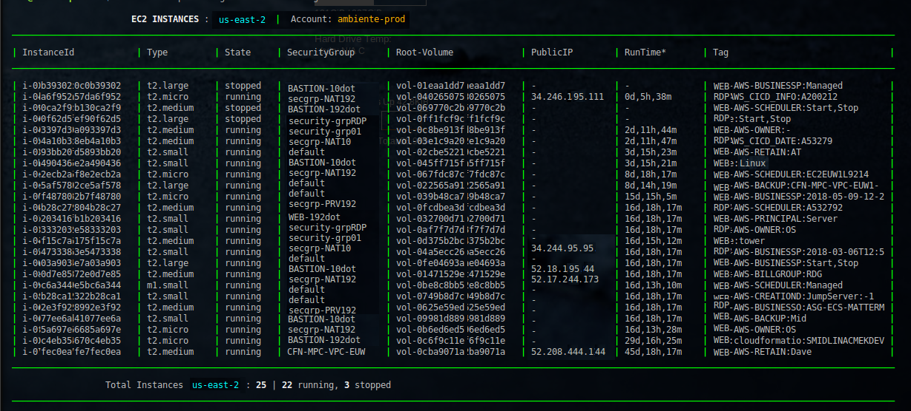
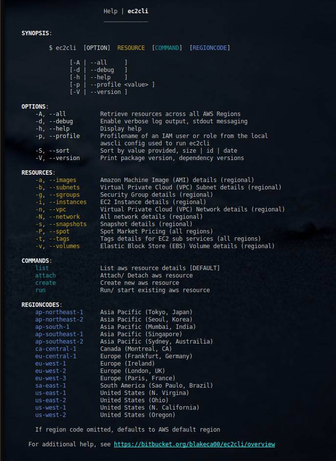
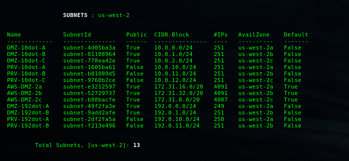
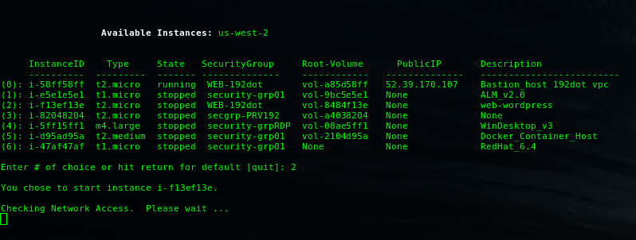

# EC2cli - Amazon EC2 Utilities


* [About](#about-this-repository)
* [License](#license)
* [Introduction](#introduction)
* [Installation](#installation)
* [Configuration](#configuration)
* [Permissions](#iam-permissions)
* [Usage](#usage)
* [Screenshots](#screenshots)
* [Contribution Guidelines](#contribution-guidelines)
* [Contact](#contact)

* * *

## About this repository

* Purpose:       CLI utilities for use with Amazon Web Services (AWS)
* Version:       2.2.2
* Repo:   		https://github.com/fstab50/ec2cli
* Mirror:       https://blakeca00@bitbucket.org/blakeca00/ec2cli.git

* * *

## License

* All utilities contained herein are copyrighted and made available under GPLv2
* See [LICENSE](./LICENSE.txt)

[back to the top](#ec2cli---amazon-ec2-utilities)

* * *

## Introduction

EC2cli was developed to make life easier when working with AWS services in a cli environment.  EC2cli  
utilizes AWS' cli tools to enable you to send signed requests to Amazon's API to perform uses cases typically  
accomplished using the console interface.  EC2cli will save time and effort to perform operations such as  
taking a snapshot or listing which EC2 instances are running.

That being said, ec2cli was designed for use with relatively low AWS resource counts.  If you are operating  
at scale, these will prove cumbersome since are no embedded filtering capabilities (if you would like to  
contribute, please see "Contributing" below).  The assumption is that if you are operating at scale, you  
have already developed your own tools for managing and operating AWS resources in a commercial environment.

While I realize that accomplishing the same functionality is easier with the AWS ruby or python SDK's, I  
developed these in bash to make them easy for system administrators and solution architects to modify for  
their particular use cases.

_Dependency Note_:  ec2cli was developed and tested under bash. Some functionality may work with other  
shells; however, your mileage may vary.

[](https://rawgithub.com/fstab50/ec2cli/master/images/ec2cli-list-instances.png)

(See [Screenshots](#screenshots) section below)

[back to the top](#ec2cli---amazon-ec2-utilities)

* * *

## Usage ##

```bash
	$ ec2cli --help     
```

[](https://rawgithub.com/fstab50/ec2cli/master/images/ec2cli-help.png)


### Notes: ###

* **RESOURCE** is required. Represents a disparate AWS resource. Only 1 resource at a time is supported.

* **COMMAND** is optional. If omitted, ec2cli defaults to the `list` command and lists details of the EC2 resource specified  
by the OPTION parameter.

* **REGIONCODE** is optional. If omitted, ec2cli defaults to the AWS default region defined in the `AWS_DEFAULT_REGION` environment  
variable (if present); or alternately, the awscli config file.

* `create` and `run` commands currently have support for limited resource types. Update your local repo frequently to enable  
additional resource types as additional types are added.

[back to the top](#ec2cli---amazon-ec2-utilities)

* * *

## Installation ##

* **General Dependencies**

	- Writable directory where utilities are located
	- One of the following python versions: 2.6.5, 2.7.X+, 3.3.X+, 3.4.X+
	- Installation Amazon CLI tools (awscli, see below this section)
	- awk, see your dist repo
	- sed, see your dist repo  

* **jq, JSON Parser**.  Install `jq` from your local distribution repository.  

```bash
	$ sudo apt-get install jq    # Ubuntu, most Debian-based distributions
```

```bash
	$ sudo yum install jq        # RedHat, Fedora, CentOS
```

* **Environment variables**:

	- Setup the following global environment variables by adding each to your	.bashrc or .bash_profile (substitute your respective values)

```bash                              
	# .bashrc / .bash_profile

	export EC2_REPO=~/git/ec2cli           # location of this README and utilities (writable)
	export SSH_KEYS=~/AWS                  # location of ssh access keys (.pem files)
	export AWS_DEFAULT_REGION=us-west-2    # your Primary AWS Region  

```

* **Python Package Manager**. If you do not currently have it, install [pip](http://www.pip-installer.org/en/latest).  

    You can install pip from your distribution's package repo via _one_ of the below  
	commands according to your Linux distribution:


| DISTRIBUTION | INSTALLATION COMMAND |  PYTHON VERSION |
| :------------------------------ | :-----------------------------------------: | :--------: |
| **Ubuntu** | ``` $ sudo apt install python-pip ``` | python2.7 |
| **Redhat** | ```  $ sudo yum install python-pip  ``` | python2.7 |
| **Fedora-based distros** | ``` $ sudo dnf install python-pip ``` | python2.7 |


* **Install the [awscli](https://github.com/aws/aws-cli/)**

    Detailed instructions can be found in the README located at:
    https://github.com/aws/aws-cli/

```bash
	$ sudo pip install awscli
```

* If you have the aws-cli installed and want to upgrade to the latest version you can run:

```bash
	$ sudo pip install --upgrade awscli
```

* Clone this git repo in a writeable directory:

```bash
	$ git clone https://blakeca00@bitbucket.org/blakeca00/ec2cli.git
```

* **Add `ec2cli` to your path**. Add the following to your .bashrc, .bash_profile, or .profile:  

```bash
    export PATH=$PATH:$EC2_REPO
```

[back to the top](#ec2cli---amazon-ec2-utilities)

* * *

## Configuration ##

* Configure awscli running the aws configure command:

```bash
   $ aws configure

	AWS Access Key ID: foo
	AWS Secret Access Key: bar
	Default region name [us-west-2]: us-west-2
	Default output format [None]: json
```

* Optionally, define a profile for a specific user:

```bash
   $ aws configure --profile testuser

    AWS Access Key ID: footestuser
    AWS Secret Access Key: bartestuser
    Default region name [us-west-2]: us-west-2
    Default output format [None]: json
```

* Command Completion

	You'll want to enable command completion to make awscli
	commands easy to type and recall.  After installing awscli,
	add the following to your .bashrc or .bash_profile:

```bash
	# .bashrc
	complete -C aws_completer aws
```

[back to the top](#ec2cli---amazon-ec2-utilities)

* * *

### Verify Your Configuration  

After completing the above Installation and Configuration sections, verify your configuration:

```bash
	$ ec2cli --version
```

[]((https://rawgithub.com/fstab50/ec2cli/master/images/ec2cli-version.png))

**Note**: Python and Kernel versions will depend upon your system parameters

[back to the top](#ec2cli---amazon-ec2-utilities)

* * *

## IAM Permissions ##

#### ec2cli Required Permissions ####
You'll need appropriate IAM permissions to execute ec2cli.  

```json
{
    "Version": "2012-10-17",
    "Statement": [
        {
            "Effect": "Allow",
            "Action": "ec2:Describe*",
            "Resource": "*"
        },
        {
            "Effect": "Allow",
            "Action": "elasticloadbalancing:Describe*",
            "Resource": "*"
        },
        {
            "Effect": "Allow",
            "Action": [
                "cloudwatch:ListMetrics",
                "cloudwatch:GetMetricStatistics",
                "cloudwatch:Describe*"
            ],
            "Resource": "*"
        },
        {
            "Effect": "Allow",
            "Action": "autoscaling:Describe*",
            "Resource": "*"
        },
        {
            "Effect": "Allow",
            "Action": [
                "ec2:AttachVolume",
                "ec2:CreateKeyPair",
                "ec2:CreateSecurityGroup",
                "ec2:CreateSnapshot",
                "ec2:DeleteSnapshot",
                "ec2:DetachVolume",
                "ec2:RunInstances",
                "ec2:StartInstances",
                "ec2:StopInstances"
            ],
            "Resource": [
                "*"
        ]
        }
    ]
}

```

You can grab a read-only version of the policy [here](./policies/iampolicy-EC2-quickview.json) or the full IAM policy which allows changes to resources [here](./policies/iampolicy-EC2-full.json).

[back to the top](#ec2cli---amazon-ec2-utilities)

* * *

## Screenshots ##

#### ec2cli `list` command ####

List command displays AWS resource details for your AWS default region if no region specified. If an alternate region given as a parameter, displays resource details for the specified region.

```bash
$ ec2cli -n list   # list vpc nextwork details, AWS default aws region (us-west-2)
```


```bash
$ ec2cli -n list eu-west-1    # list vpc nextwork details, alternate region (eu-west-1)
```


```bash
$ ec2cli -b    # list subnet details, AWS default region (us-west-2)
               # if no COMMAND given, command defaults to 'list'
```


```bash
$ ec2cli -b eu-west-1    # list subnet details, alternate region (eu-west-1)
```


```bash
$ ec2cli -i    # list ec2 instances, AWS default region (us-west-2)
```


```bash
$ ec2cli -i    # list (running) ec2 instances, AWS default region (us-west-2)
```


```bash
$ ec2cli -v    # list ebs volume details, AWS default region (us-west-2)
```


```bash
$ ec2cli -s    # list snapshots, AWS default region (us-west-2)
```


```bash
$ ec2cli -g    # list security group details, AWS default region (us-west-2)
```


```bash
$ ec2cli -g us-east-1    # list security group details, alt region (us-east-1)
```


[back to the top](#ec2cli---amazon-ec2-utilities)

* * *

## Screenshots ##

#### ec2cli `run` command ###

*Note: this utility may also be used to automate login to a running EC2 instance*
*as well as starting a stopped instance. See step 2. (below)*

```bash
$ ec2cli -i run    # run/ log on to EC2 instances in default region
```
1.Select from list of instance choices:


2.After instance is chosen, ec2cli performs a network access check:

  * Access check sources the security group and validates IPs listed in the group against your local IP.
  * _Note_: if the instance you chose is already running, the ec2cli moves immediately to authentication (Step 4).



3.If network access check succeeds, the ec2 wait function is called to prevent login until the instance starts.


4.Authentication start:

  * Public IP and ssh key name are sourced from instance json data via api call.
  * The ssh key is then located on your local machine in the dir specified by the ``$SSH_KEYS`` env variable.


5.Login established (entire start sequence shown)


[back to the top](#ec2cli---amazon-ec2-utilities)

* * *

## Screenshots ##

### Spot Price Utility ###

[Screenshots (continued)](./README_spot.md)

[back to the top](#ec2cli---amazon-ec2-utilities)

* * *

## Contribution Guidelines ##

   If you'd like to contribute, please fork and then send me
   a pull request.

[back to the top](#ec2cli---amazon-ec2-utilities)

* * *

## Contact ##

* Repo owner:  Blake Huber // @B1akeHuber

[back to the top](#ec2cli---amazon-ec2-utilities)
