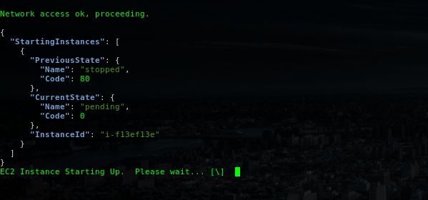
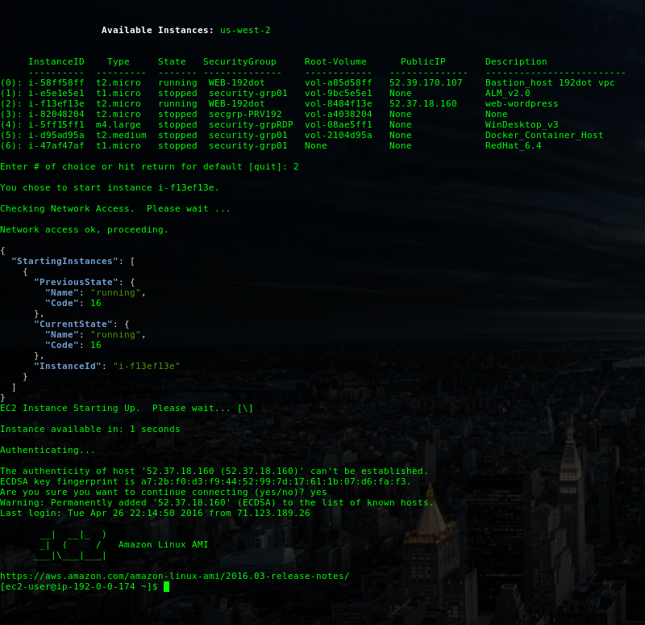

# EC2cli - Utilities for working with Amazon EC2 

* [About](#about-this-repository)
* [License](#license)
* [Introduction](#introduction)
* [Contents](#contents)
* [Installation](#installation)
* [Configuration](#configuration)
* [Aliases](#aliases)
* [Permissions](#iam-permissions)
* [Usage](#usage)
* [Screenshots](#screenshots)
* [Contribution Guidelines](#contribution-guidelines)
* [Contact](#contact)

* * *

## About this repository 

* Purpose:       CLI utilities for use with Amazon Web Services (AWS)
* Version:       0.74 
* Repo:          [ec2cli] https://blakeca00@bitbucket.org/blakeca00/ec2cli.git
* Mirror repo:   https://github.com/t-stark/ec2cli 

* * *

## License 

* All utilities contained herein are copyrighted and made available under GPLv2
* See [LICENSE](./LICENSE)

* * *

## Introduction 

EC2cli was developed to make life easier when working with AWS services in a
cli environment.  EC2cli utilizes AWS' cli tools to enable you to send signed 
requests to Amazon's API to perform uses cases typically accomplished using the 
console interface.  EC2cli will save time and effort to perform operations
such as taking a snapshot or listing which EC2 instances are running.

That being said, ec2cli was designed for use with relatively low AWS resource counts.  If you are operating at scale, these will prove cumbersome since are no embedded filtering capabilities (if you would like to contribute, please see "Contributing" below).  The assumption is that if you are operating at scale, you have already developed your own tools for managing and operating AWS resources in a commercial environment.

While I realize that accomplishing the same functionality is easier with the AWS ruby or python SDK's, I developed these in bash to make them easy for system administrators and solution architects to modify for their particular use cases.

_Dependency Note_:  ec2cli was developed and tested under bash. Some functionality may work with other shells; however, your mileage may vary.


(See [Screenshots](#screenshots) section below)

* * *

## Contents ##
```bash
* ec2cli                    # Main executable for working with EC2 resources from cli environment
* ec2-qv-spot-prices.sh     # Quick view of spot prices in region specified

# init/                     # EC2 host-based scripts

* motd-ec2.sh               # dynamic message of the day for EC2 instances. Dep on ec2-az-location.sh
* ec2-hostname.sh           # resets EC2 hostname upon (re)start, part of init process
* ec2-az-location.sh        # grabs region from metadata service. Called by motd-ec2.sh
* ec2.bash_profile          # sample bash_profile (Amazon Linux)
```

* * *

## Installation ##

* General Dependencies
	- Writable directory where utilities are located
	- One of the following python versions: 2.6.5, 2.7.X+, 3.3.X+, 3.4.X+
	- Installation Amazon CLI tools (awscli, see below this section)
	- awk, see your dist repo
	- sed, see your dist repo

* Install jq, a JSON parser from your local distribution repository.
```bash
	$ sudo apt-get install jq    # Ubuntu, most Debian-based distributions
```
```bash
	$ sudo yum install jq        # RedHat, Fedora, CentOS 
```

* Environment variables: 
	Setup the following global environment variables by adding each to your	.bashrc or .bash_profile (substitute your respective values)
```bash                              
	# .bashrc / .bash_profile 

	export EC2_REPO=~/git/ec2cli           # location of this README and utilities (writable)
	export SSH_KEYS=~/AWS                  # location of ssh access keys (.pem files)
	export AWS_ACCESS_KEY=XXXXXXXXXXXXX    # Your IAM Access Key
	export AWS_SECRET_KEY=XXXXXXXXXXXXX    # Your Secret Key
	export AWS_DEFAULT_REGION=us-west-2    # your Primary AWS Region  
```

* Install [awscli](https://github.com/aws/aws-cli/)
	
	Detailed instructions can be found in the README located at:
	https://github.com/aws/aws-cli/

	The easiest method, provided your platform supports it, is via [pip](http://www.pip-installer.org/en/latest).

```bash
	$ sudo pip install awscli
```

* If you have the aws-cli installed and want to upgrade to the latest version you can run:

```bash
	$ sudo pip install --upgrade awscli
```

* Clone this git repo in a writeable directory:

```bash
	$ git clone https://blakeca00@bitbucket.org/blakeca00/ec2cli.git
```

* * *

## Configuration ##

* Configure awscli running the aws configure command:

```bash
   $ aws configure
	
	AWS Access Key ID: foo
	AWS Secret Access Key: bar
	Default region name [us-west-2]: us-west-2
	Default output format [None]: json
```

* Alternatively, to configure awscli using environment variables, do the following:

```bash
	$ export AWS_ACCESS_KEY_ID=<access_key>
	$ export AWS_SECRET_ACCESS_KEY=<secret_key>
```

* A 3rd alternate, is to use a configuration file like this:

```bash
	[default]
	aws_access_key_id=<default access key>
	aws_secret_access_key=<default secret key>
```

* Optional, define a default region for a specific profile by placing the following in ~/.aws/config:

```bash
	[profile testing]
	aws_access_key_id=<testing access key>
	aws_secret_access_key=<testing secret key>
	region=us-west-2
```

* Command Completion 
   	
	You'll want to enable command completion to make awscli
	commands easy to type and recall.  After installing awscli,
	add the following to your .bashrc or .bash_profile:

```bash
	# .bashrc
	complete -C aws_completer aws
```

* Update your path by adding the following to your .bashrc, .bash_profile, or .profile:
```bash
    export PATH=$PATH:$EC2_REPO
```

* Setup shortcut aliases (optional, see [Aliases](#aliases) below)

* * *

## Aliases ##

This section is optional. Add the following to your .bash_profile or .bashrc as convenient cli shortcuts:
```bash
# Shortcut Aliases - AWS
alias ec2a="$EC2_REPO/ec2cli -a list"      # list of Amazon Machine Images, default region
alias ec2i="$EC2_REPO/ec2cli -i list"      # list of EC2 instances, default region
alias ec2s="$EC2_REPO/ec2cli -s list"      # list of snapshots, default region
alias ec2g="$EC2_REPO/ec2cli -g list"      # list of security groups, default region
alias ec2b="$EC2_REPO/ec2cli -b list"      # list of subnets, default region
alias ec2v="$EC2_REPO/ec2cli -v list"      # list of Elastic Block Store Volumes, default region
alias ec2n="$EC2_REPO/ec2cli -n list"      # list of VPCs, default region
alias awsnet="$EC2_REPO/ec2cli -N list"    # complete networking configuration, default region
```

* * *
 
## IAM Permissions ##

#### ec2cli Required Permissions ####
You'll need appropriate IAM permissions to execute ec2cli.  

```json
{
    "Version": "2012-10-17",
    "Statement": [
        {
            "Effect": "Allow",
            "Action": "ec2:Describe*",
            "Resource": "*"
        },
        {
            "Effect": "Allow",
            "Action": "elasticloadbalancing:Describe*",
            "Resource": "*"
        },
        {
            "Effect": "Allow",
            "Action": [
                "cloudwatch:ListMetrics",
                "cloudwatch:GetMetricStatistics",
                "cloudwatch:Describe*"
            ],
            "Resource": "*"
        },
        {
            "Effect": "Allow",
            "Action": "autoscaling:Describe*",
            "Resource": "*"
        },
        {
            "Effect": "Allow",
            "Action": [
                "ec2:AttachVolume",
                "ec2:CreateKeyPair",
                "ec2:CreateSecurityGroup",
                "ec2:CreateSnapshot",
                "ec2:DeleteSnapshot",
                "ec2:DetachVolume",
                "ec2:RunInstances",
                "ec2:StartInstances",
                "ec2:StopInstances"
            ],
            "Resource": [
                "*"
        ]
        }
    ]
}

```

You can grab a read-only version of the policy [here](./policies/iampolicy-EC2-quickview.json) or the full IAM policy which allows changes to resources [here](./policies/iampolicy-EC2-full.json).

* * *

## Usage ##
```bash
$ ec2cli --help     

 Help Contents

   Usage : ec2cli [OPTION] [COMMAND] [REGIONCODE] 

   Options :
     -a, --images       Amazon Machine Image (AMI) details for region
     -b, --subnets      Virtual Private Cloud (VPC) Subnet details
     -g, --sgroups      Security Group details for region
     -h, --help         Output this message
     -i, --instances    EC2 Instance details for region
     -n, --vpc          Virtual Private Cloud (VPC) Network details for region
     -N, --network      All network details for region
     -s, --snapshots    Snapshot details for region    
     -t, --tags         Tags details for EC2 sub services (all regions)
     -v, --volumes      Elastic Block Store (EBS) Volume details for region
  
   Commands (optional) : 
     list               List aws resource details [DEFAULT]
     attach             Attach/ Detach aws resource 
     create             Create new aws resource
     run                Run/ start existing aws resource

   Region Codes (optional) : 
     ap-northeast-1     Asia Pacific (Tokyo, Japan)       
     ap-northeast-2     Asia Pacific (Seoul, Korea)      
     ap-south-1         Asia Pacific (Mumbai, India)
     ap-southeast-1     Asia Pacific (Singapore)       
     ap-southeast-2     Asia Pacific (Sydney, Austrailia) 
     eu-central-1       Europe (Frankfurt, Germany)       
     eu-west-1          Europe (Ireland)          
     sa-east-1          South America (Sao Paulo, Brazil)
     us-east-1          United States (N. Virgina)   
     us-west-1          United States (N. California)    
     us-west-2          United States (Oregon)  

     If region code omitted, defaults to AWS default region 
    
   For additional help, see https://bitbucket.org/blakeca00/ec2cli/overview
```
#### Notes: ####
* OPTION is required. Since an option represents a disparate AWS resource, only 1 option (resource) at a time is supported.
* COMMAND is optional. If omitted, ec2cli defaults to the 'list' command and lists details of the EC2 resource specified by the OPTION parameter.
* REGIONCODE is optional. If omitted, ec2cli defaults to the AWS default region defined in the $AWS_DEFAULT_REGION environment variable (if present); or alternately, the awscli config file.
* `create` and `run` commands currently have support for limited resource types. Update your local repo frequently to enable additional resource types as additional types are added.

* * *

## Screenshots ##
#### ec2cli `list` command #####
List command displays AWS resource details for your AWS default region if no region specified. If an alternate region given as a parameter, displays resource details for the specified region.

```bash
$ ec2cli -n list   # list vpc nextwork details, AWS default aws region (us-west-2)
```


```bash
$ ec2cli -n list eu-west-1    # list vpc nextwork details, alternate region (eu-west-1)
```


```bash
$ ec2cli -b    # list subnet details, AWS default region (us-west-2)
               # if no COMMAND given, command defaults to 'list'
```


```bash
$ ec2cli -b eu-west-1    # list subnet details, alternate region (eu-west-1)
```


```bash
$ ec2cli -i    # list ec2 instances, AWS default region (us-west-2)
```


```bash
$ ec2cli -i    # list (running) ec2 instances, AWS default region (us-west-2)
```


```bash
$ ec2cli -v    # list ebs volume details, AWS default region (us-west-2)
```


```bash
$ ec2cli -s    # list snapshots, AWS default region (us-west-2)
```


```bash
$ ec2cli -g    # list security group details, AWS default region (us-west-2)
```


```bash
$ ec2cli -g us-east-1    # list security group details, alt region (us-east-1)
```


* * * 
## Screenshots ##
#### ec2cli `run` command ####

*Note: this utility may also be used to automate login to a running EC2 instance*
*as well as starting a stopped instance. See step 2. (below)* 

```bash
$ ec2cli -i run    # run/ log on to EC2 instances in default region
```
1.Select from list of instance choices:


2.After instance is chosen, ec2cli performs a network access check:

  * Access check sources the security group and validates IPs listed in the group against your local IP. 
  * _Note_: if the instance you chose is already running, the ec2cli moves immediately to authentication (Step 4).


3.If network access check succeeds, the ec2 wait function is called to prevent login until the instance starts.



4.Authentication start:

  * Public IP and ssh key name are sourced from instance json data via api call.
  * The ssh key is then located on your local machine in the dir specified by the ``$SSH_KEYS`` env variable. 


5.Login established (entire start sequence shown)



* * *
## Screenshots ##
#### Spot Price Utility ####

[Screenshots (continued)](./README_spot.md)

* * *

## Contribution Guidelines ##

   In header of most utilities, there is a FUTURE section
   containing feature enhancements so these utilities can stand
   alone.

   If you'd like to contribute, please fork and then send me 
   a pull request.

* * *

## Contact ##

* Repo owner:  Blake Huber // @B1akeHuber
